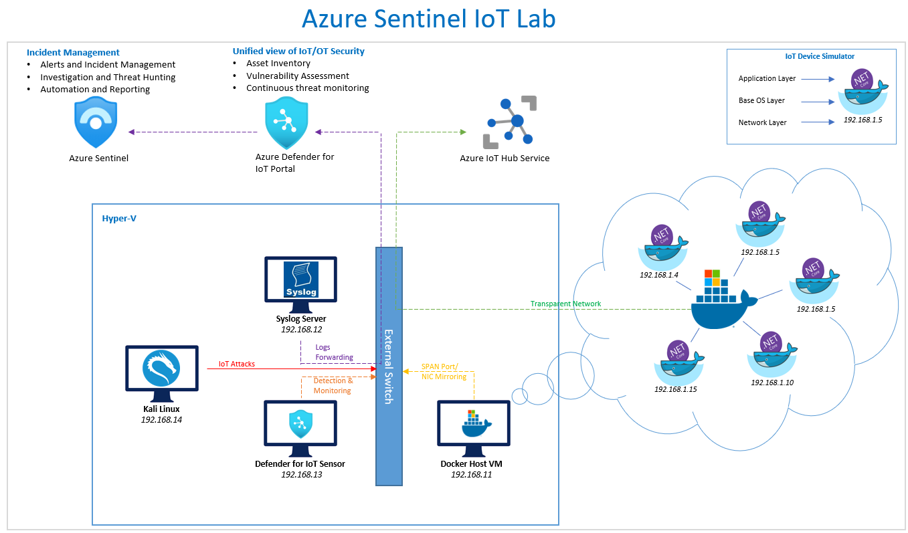
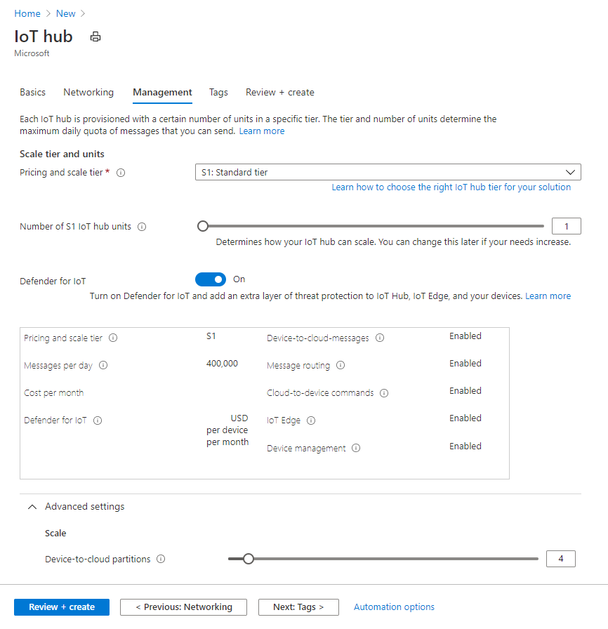
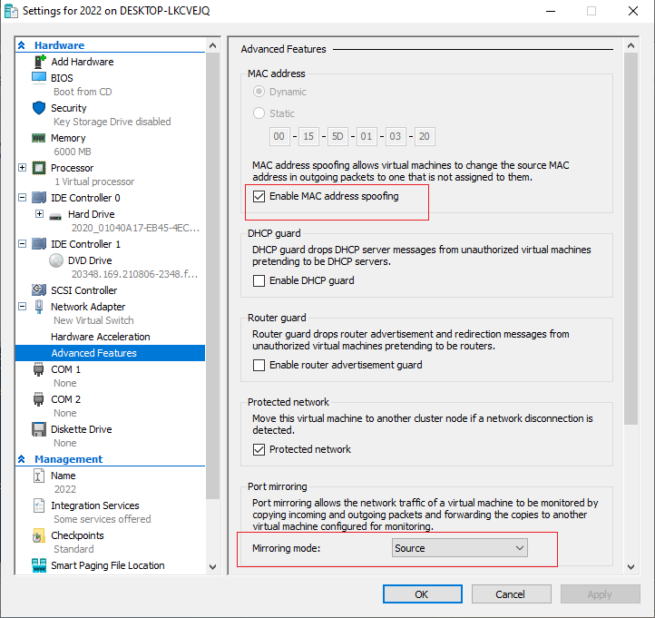
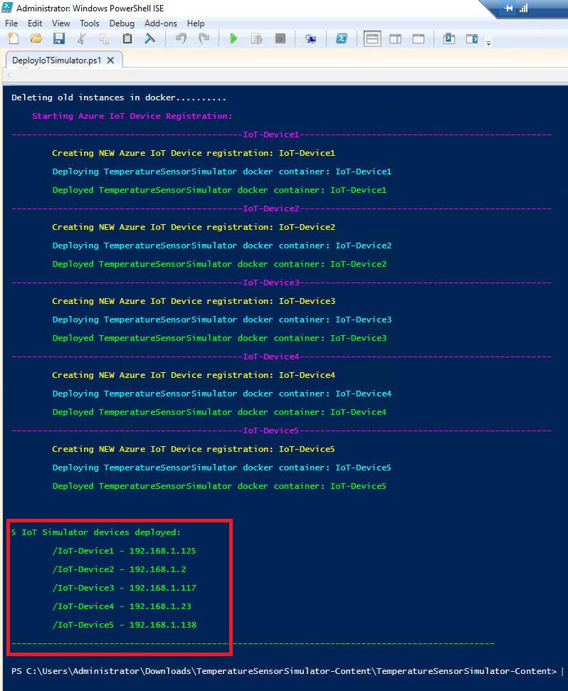
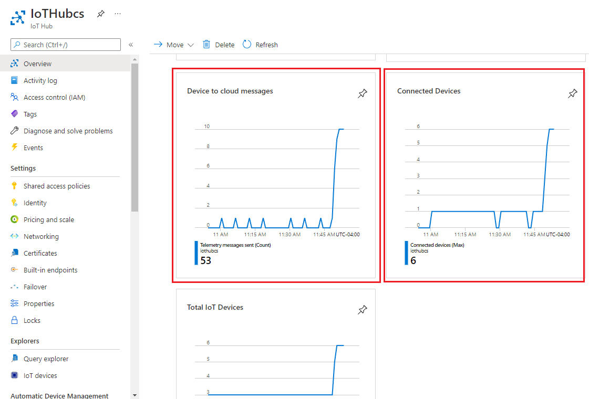

# Azure Sentinel – Create Azure IoT Lab Environment 

</br>

## Table of Contents

1.  <u>Overview</u>

2.  <u>Getting Started</u>

    -   <u>Prerequisites</u>

    -   <u>Installation</u>

3.  <u>Usage</u>

4.  <u>Contact</u>

</br>

## Overview

Azure IoT lab environment is designed to provide Azure Sentinel Customer
a robust and dynamic lab environment to perform Red/Blue team exercise
in order to evaluate Azure Sentinel capabilities for IoT monitoring. The
lab can also be used as a continuous testing and training platform for
testing new attacks and remediation automations.

The lab consists of docker containers running a .net core simulator app
which communicates to Azure IoT hub service using MTTQ over WebSocket
simulating a real world IoT solution. The Docker containers are assigned
Local-LAN dynamic (DHCP) IP address using a network created with the
'[transparent' Network
driver](https://docs.microsoft.com/en-us/virtualization/windowscontainers/container-networking/network-drivers-topologies#transparent-network-driver)
available via Hyper-V on Windows Servers, enabling the containers to be
directly access on Local-LAN and having internet access via the Hyper-V
external switch.

The docker container simulates an actual IoT Device by simulating
Application, Base OS, and network layers. Defender for IoT will treat
each docker container as if it’s new stand-a-lone IoT device on the
network.

The lab environment could easily be extended by adding a Kali-Linux VM
on the same external Hyper-V switch to launch attacks and perform blue
team exercise.

>> ***Click on Image to Enlarge



</br>
</br>

## Getting Started

Use the following steps to correctly configure Azure Sentinel IoT Lab
environment.

</br>

## Prerequisites

-   Hyper-V enable local host machine (Windows 10 or Server 2016 and
    above)

-   Internet connectivity

</br>

# Installation

</br>

## ***<u>Azure IoT Hub Configuration</u>***

1.  Follow Microsoft Documentation on how to create IoT Hub [Use the
    Azure portal to create an IoT Hub \| Microsoft
    Docs](https://docs.microsoft.com/en-us/azure/iot-hub/iot-hub-create-through-portal)

2.  Make sure the Pricing and Scale Tier is set to “**S1: Standard
    Tier**” and **Defender for IoT** is turned on.



</br></br>

## ***<u>Docker Host VM Configuration</u>***

1.  Create new Server 2016 or above VM with a new external network
    switch. (**Note:** Do not use Default switch as it does not support
    NIC Spoofing)

2.  **Before turning on the VM:**

    1.  Run the following PowerShell statement to enable nested
        virtualization
```PowerShell
        Set-VMProcessor -VMName \<VMName> -ExposeVirtualizationExtensions $true
```
2.  Configure MAC Spoofing and Port Mirroring (set as Source)

> 

3.  Turn on VM and install Windows and update.

4.  **Turn Off Windows Firewall**
```PowerShell
       Set-NetFirewallProfile -Profile Domain,Public,Private -Enabled False
```
5.  **Install Az PowerShell Modules**
```PowerShell
      Install-Module Az -Force
```
6.  **Install Windows Container Features on VM**
```PowerShell
      Install-WindowsFeature -Name Hyper-V -IncludeManagementTools
    
      Install-WindowsFeature -Name Containers
    
      Restart-Computer
```
7.  **Install Docker**
```PowerShell
     Install-Module DockerProvider -force
    
     Install-Package Docker -ProviderName DockerProvider -RequiredVersion
     preview -force
    
     Restart-Computer
```
8.  **Create Docker Transparent Network called DockerNet**
```PowerShell
    docker network create -d transparent --subnet=192.168.1.0/24 --gateway=192.168.1.1 DockerNet
```
</br></br>

## ***<u>Deploy Docker Containers</u>***

1.  Download ‘TemperatureSensorSimulator-Content.zip’ provided as in current repo and extract

2.  Run the ‘DeployIoTSimulator.ps1’ script

3.  Enter the count of IoT simulators to deploy

4.  Once the script finishes it will display all the containers deployed
    with their IP address.



5.  You can verify that the new simulator devices are communicating to
    Azure IoT Hub.



</br></br>

***Clean up***

1.  Run the ‘CleanUp.ps1’ script to delete all IoT simulator devices.

</br>

***Deploy Defender for IoT***
1.	Follow instructions [here](https://docs.microsoft.com/en-us/azure/defender-for-iot/organizations/how-to-install-software#sensor-installation-for-the-virtual-appliance) to deploy Defender for IoT on a Hyper-V VM. 
2.	Follow steps [here](https://docs.microsoft.com/en-us/azure/defender-for-iot/organizations/how-to-install-software#configure-a-span-port) to configure SPAN port on Hyper-V
3.	Details on how to [activate](https://docs.microsoft.com/en-us/azure/defender-for-iot/organizations/how-to-activate-and-set-up-your-sensor) Defender for IoT Hyper-V Sensor

</br>


**Contact**

Email: <MicrosoftTeam@criticalstart.com>

**About**

Add Something Here


